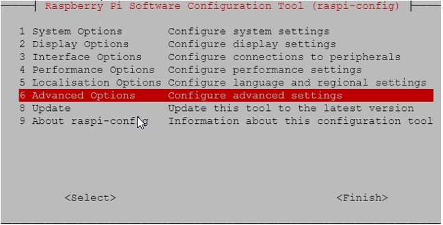
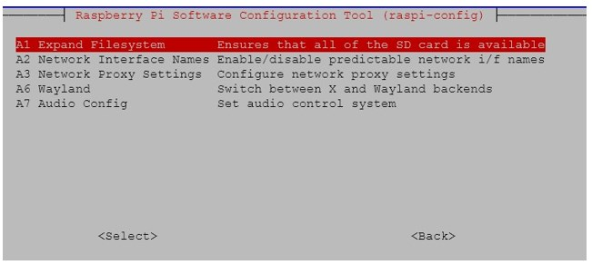
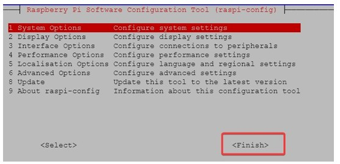

# RPI Docker setup

### RPI manager

Start the RPI Imager tool and follow these steps:

- select your RPI model
- Select OS > Raspberry PI OS (other) > Raspberry Pi OS Lite (64-bit)
- Choose storage > Select your SD card

Settings:

- hostname: rpi-enecsys
- username: pi
- password: saved in keychain

Furthermore selected SSH and fixed the timezone.

### SSH connection

Find your IP address, using your modem. Then create a connection.

```bash
ssh pi@192.168.1.185
```

Sign in with your password.

### Raspi config - Advanced options

After logging in via SSH we change some basic settings.

run this command:

```
sudo raspi-config
```

Interacting with the screen? Arrow keys, TAB, spacebar and ENTER key.

- Select 6 Advanced options > Enter
- Select A1 expand Filesystem > Enter > Ok






We will reboot after all steps are complete.

### Raspi config - Save and Reboot

Return back to the main menu and select Finish > Enter.
This will reboot the RPI with the new settings.



## Prepare enecsys installer

```bash
sudo apt update && sudo apt upgrade -y

```

### Add Docker

Docker prerequisites:

```bash
# Add Docker's official GPG key:
sudo apt update
sudo apt install ca-certificates curl
sudo install -m 0755 -d /etc/apt/keyrings
sudo curl -fsSL https://download.docker.com/linux/debian/gpg -o /etc/apt/keyrings/docker.asc
sudo chmod a+r /etc/apt/keyrings/docker.asc

# Add the repository to Apt sources:
sudo tee /etc/apt/sources.list.d/docker.sources <<EOF
Types: deb
URIs: https://download.docker.com/linux/debian
Suites: $(. /etc/os-release && echo "$VERSION_CODENAME")
Components: stable
Architectures: $(dpkg --print-architecture)
Signed-By: /etc/apt/keyrings/docker.asc
EOF

sudo apt update
```

Docker tools:

```bash
sudo apt install docker-ce docker-ce-cli containerd.io docker-buildx-plugin docker-compose-plugin
```

Verify the docker installation is successful:

```bash
sudo systemctl status docker
```

If you don't want to add `sudo` in front of your docker command do the following:

```bash
sudo groupadd docker
sudo usermod -aG docker $USER
newgrp docker
```

### Pull in the repository

```bash
cd ~

# for now using the repo from pepijn
git clone https://github.com/pepijngriffioen/Enecsys_Dashboard.git

# feature branch
git checkout feat/docker
```

Add the static ip:

```bash
cd Enecsys_Dashboard/installers
sudo bash 1.sudo_static_ip.sh
sudo reboot
```

Build the local containers:

```bash
sudo make app
sudo make db
```

Generate the passwords:

```bash
cd ~/Enecsys_Dashboard/compose
{
  ENECSYS_DBPREFIX="enecsys"
  ENECSYS_DB="$(openssl rand -hex 3)"
  ENECSYS_DBNAME="${ENECSYS_DBPREFIX}_${ENECSYS_DB}"
  ENECSYS_USERNAME="${ENECSYS_DBPREFIX}_${ENECSYS_DB}"
  ENECSYS_DB_PASSWORD="$(openssl rand -hex 8)"
  MYSQL_ROOT_PASSWORD="$(openssl rand -hex 12)"

  printf "ENECSYS_DBNAME=%s\n" "$ENECSYS_DBNAME"
  printf "ENECSYS_USERNAME=%s\n" "$ENECSYS_USERNAME"
  printf "ENECSYS_DB_PASSWORD=%s\n" "$ENECSYS_DB_PASSWORD"
  printf "MYSQL_ROOT_PASSWORD=%s\n" "$MYSQL_ROOT_PASSWORD"
} > .env
```

### Start the application

Start the application

```bash
cd ~/Enecsys_dashboard/compose
sudo docker compose up -d
sudo docker compose logs -f
```

Now wait till you see the database credentials. In the logs. You can also store them in the docker compose environment file.

## Access the application

Since I gave the rpi a hostname, we can use it go to: <http://rpi-enecsys:8080>

Or use your IP address, in my case: 192.168.1.185:8080

Here you will see an error, because the connection file has not been created. Let's generate it.

<http://rpi-enecsys:8080/install_process.php>

## Setup the Inverters

See the notes from earlier [install.md](../installation/INSTALL.md)

## Danger zone: delete the data

If you want to get rid of all your state, you can run the following command:

```bash
# -v is also delete the volumes
docker compose down -v
```
